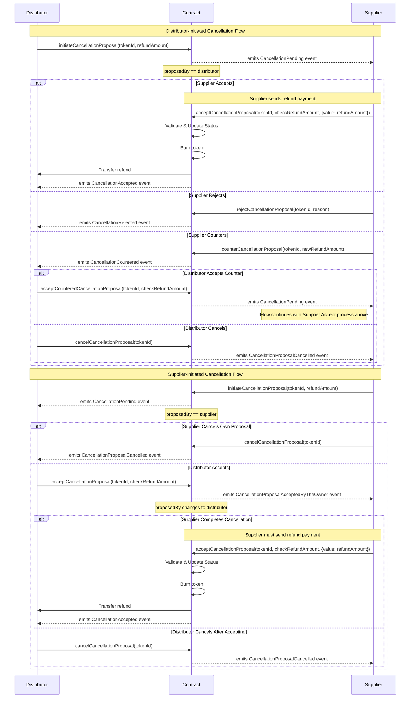

# Booking Token Cancellation Process

The Camino Messenger platform implements a flexible cancellation system for booking
tokens that accommodates both distributor-initiated and supplier-initiated
cancellations. The process is designed to allow negotiation between parties while
maintaining security and clarity throughout the cancellation flow.

## Overview

The cancellation process can be initiated by either the distributor (token owner) or
the supplier, with different flows depending on who initiates the cancellation. Each
flow includes safety checks, refund handling, and clear state transitions managed
through smart contracts.

## Cancellation Flows

### Distributor-Initiated Cancellation

When a distributor initiates a cancellation, the following options are available to
the supplier:

1. **Direct Acceptance**

   - The supplier can accept the cancellation by providing the agreed refund amount
   - Upon acceptance, the token is burned and the refund is transferred to the
     distributor

2. **Rejection**

   - The supplier can reject the cancellation with a specific reason
   - This terminates the cancellation process

3. **Counter-Proposal**
   - The supplier can counter with a different refund amount
   - The distributor can then either:
     - Accept the counter-proposal, leading to the supplier's acceptance flow
     - Cancel the entire cancellation process

### Supplier-Initiated Cancellation

When a supplier initiates a cancellation, the process differs slightly:

1. **Initial Proposal**

   - The supplier proposes a cancellation with a specific refund amount
   - The supplier can cancel their own proposal at any time before distributor
     acceptance

2. **Distributor Acceptance**
   - If the distributor accepts, the proposal ownership transfers to the distributor
   - The supplier must then complete the cancellation by providing the refund
   - The distributor can still cancel after accepting but before the supplier
     completes the process

## Security and Validation

- All refund amounts are validated at multiple steps
- Both parties must agree on the final refund amount
- The token state is managed securely throughout the process
- Events are emitted at each step to maintain transparency
- Smart contract state transitions prevent invalid operation sequences

## Refund Processing

- Refunds can be processed in native currency or ERC20 tokens
- The supplier must provide the exact refund amount agreed upon
- Refunds are automatically transferred to the distributor upon successful
  cancellation
- The token is burned only after successful refund transfer

This process ensures a fair, secure, and flexible system for handling booking
cancellations while maintaining the integrity of the booking token system.

## Sequence Diagram

